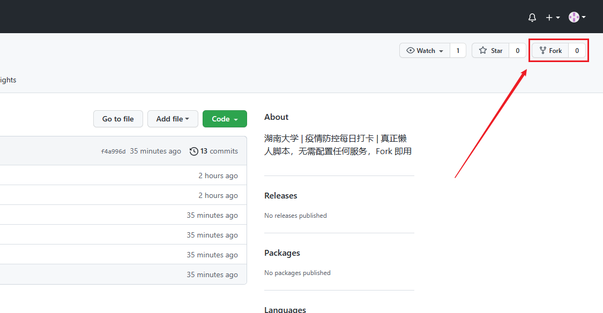
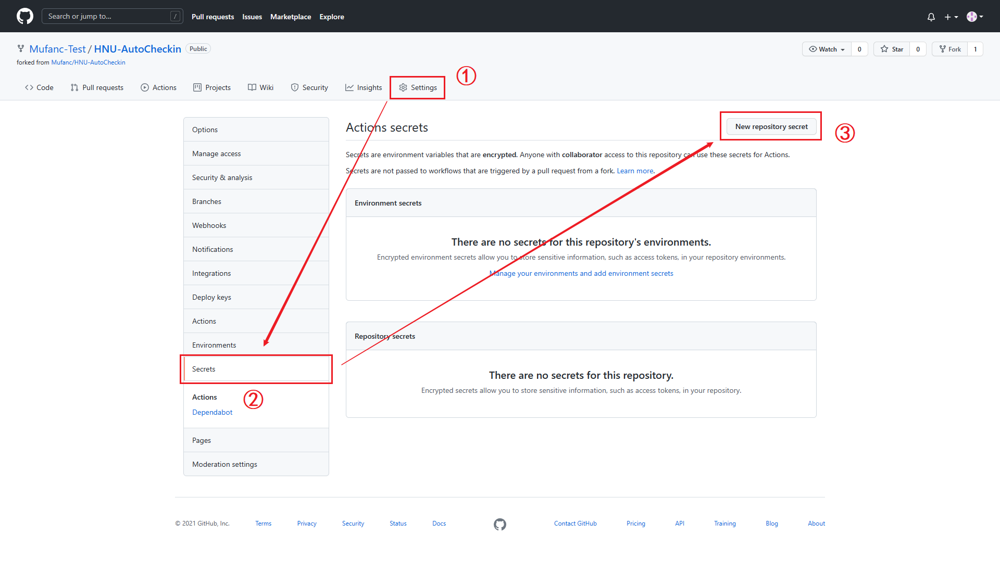
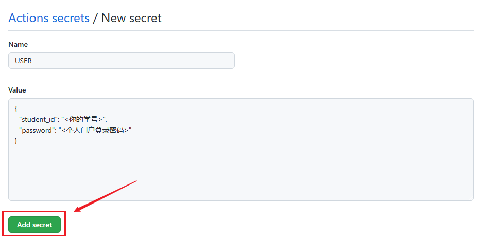
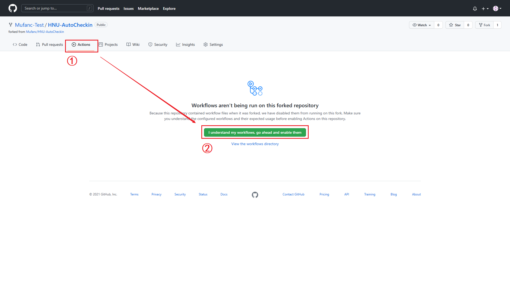
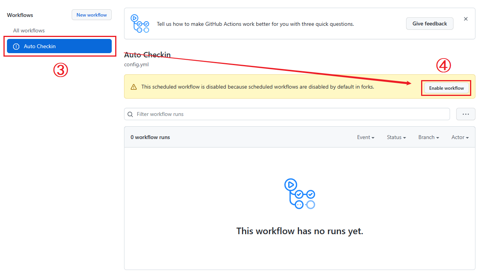
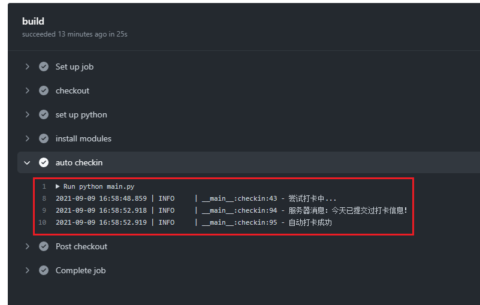

## HNU-AutoCheckin

* **警告：使用前详阅**

&emsp;&emsp;**该项目仅用于无异常情况时的自动打卡，如有体温异常、身体不适或其他情况请严格按照学校规定及时上报。继续使用该脚本即代表同意上述条例，由此产生的一切后果，由使用者本人承担！**

### 使用说明

&emsp;&emsp;脚本基于 GitHub Actions 实现打卡功能，本地无需配置任何服务，且完全开源免费！当 Action 失败时 GitHub 会发送邮件提醒，真正做到万无一失。下面是配置教程：

* 你首先需要拥有一个 GitHub 账户，或者 [点击这里](https://github.com/signup) 注册一个

* 登录 GitHub 账户后回到此页面，然后点击右上角的 `Fork` 按钮



* Fork 成功后页面会跳转到你自己的仓库，接下来点击上方的 `Settings`，然后切换到 `Secrets` 选项卡，点击右上角的 `New repository secret`



* Name 填写 `USER` **（大写）**，而 Value 的值请参考下面的 [配置文件说明](#配置文件) 

* 填写好后点击下方 `Add Secret` 按钮，保存配置



* 然后回到仓库页面，按照图示顺序启用工作流





* 恭喜！全部配置完成，你可以点击页面右上角的 `Star` 然后取消，如果前面的配置正确，刷新 Actions 页面后可以看到脚本运行的提示，点进去可以查看详细




* 若无报错信息，说明已经可以正常使用，脚本会在**每天的 04:00、04:30、05:00、05:30 四个时间点**尝试打卡（可能会有最多半个小时左右的时间差）

* 如果你想换个时间，请手动修改项目中 `.github/workflows/config.yml` 文件

### 配置文件

* 一个最简的配置文件至少要包含学号和密码，就像下面这样：

```json
{
  "student_id": "<你的学号>",
  "password": "<个人门户登录密码>"
}
```

简单举个例子：

```json
{
  "student_id": "20202601xxxx",
  "password": "12345678"
}
```

* 或者你可以使用包含更多选项的配置文件：

```json
{
  "student_id": "<你的学号>",
  "password": "<个人门户登录密码>",
  "random": false,
  "address": ["湖南省", "长沙市", "岳麓区", "湖南大学"],
   
  "max_trial": 20,
  "failed_wait": 60,
  "success_tint": ["今天已提交过打卡信息！", "成功"]
}
```

其中参数含义如下表所示：

| 属性名 | 含义 |
| :---: | :--- |
| `student_id` | 学号 |
| `password` | 个人门户登录密码 |
| `random` | 是否随机体温（`true` 为 `36.3 - 36.8`, `false` 为 `36.5`），默认 `false` |
| `address` | 地址，默认为湖南省、长沙市、岳麓区、湖南大学，其中**前三项请谨慎修改** |
| `max_trial` | 最大重试次数，超过此次数则认为打卡失败 |
| `failed_wait` | 失败后等待的秒数，默认 `60` |
| `success_tint` | 若服务器返回信息位于列表中则认为打卡成功，**请谨慎修改** |
